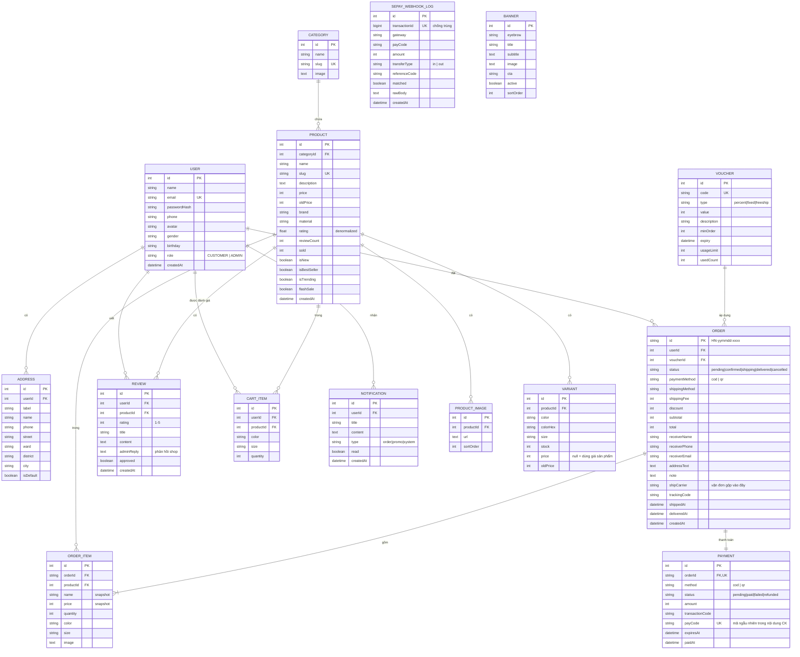

# Hoàng Nha Fashion — Thiết kế Cơ sở dữ liệu (ERD — 15 bảng)

Bản rút gọn: đủ cho một shop thời trang bình thường, logic chặt chẽ, không có
các chức năng vận hành nâng cao (điểm thưởng, đổi/trả, nhật ký kho, bộ sưu tập,
tạp chí...). Giữ lại tích hợp thanh toán chuyển khoản **SePay**.

## 1. Danh sách 15 bảng

| # | Bảng | Vai trò |
|---|---|---|
| 1 | **User** | Tài khoản khách + admin |
| 2 | **Address** | Sổ địa chỉ giao hàng |
| 3 | **Category** | Danh mục sản phẩm |
| 4 | **Product** | Sản phẩm (cờ `isNew/isBestSeller/flashSale` thay cho bảng bộ sưu tập/chiến dịch) |
| 5 | **ProductImage** | Ảnh gallery của sản phẩm |
| 6 | **Variant** | Biến thể màu × size × tồn kho (+ giá riêng) |
| 7 | **CartItem** | Giỏ hàng (đồng bộ theo tài khoản) |
| 8 | **Order** | Đơn hàng (đã gộp thông tin vận đơn) |
| 9 | **OrderItem** | Dòng đơn hàng — snapshot giá lúc mua |
| 10 | **Payment** | Giao dịch thanh toán (COD / chuyển khoản QR) |
| 11 | **SepayWebhookLog** | Nhật ký webhook SePay — chống ghi nhận trùng |
| 12 | **Voucher** | Mã giảm giá |
| 13 | **Review** | Đánh giá sản phẩm (+ phản hồi của shop) |
| 14 | **Notification** | Thông báo cho khách |
| 15 | **Banner** | Banner hero trang chủ (CMS) |

> **Wishlist** (yêu thích) lưu ở `localStorage` phía trình duyệt, không cần bảng.
> **"Đã xem gần đây"** cũng lưu `localStorage`.

## 2. Sơ đồ ERD (Mermaid)

## 3. Các quyết định thiết kế để "logic chặt chẽ"

### 3.1. Đặt hàng — transaction nguyên tử (không tin client)
`POST /api/orders` tính lại **toàn bộ** giá/phí/giảm giá từ DB, rồi gói mọi thao
tác ghi trong một transaction — bất kỳ bước nào lỗi thì rollback sạch:
1. Lấy sản phẩm + biến thể từ DB, **variant bắt buộc tồn tại** (không đặt được "hàng ma").
2. Trừ kho **có điều kiện** `UPDATE ... WHERE stock >= qty` — MySQL khóa dòng nên
   hai đơn tranh món cuối thì chỉ một đơn thành công, đơn kia rollback (chống race).
3. Tăng `Voucher.usedCount` có điều kiện `< usageLimit` (chống vượt lượt khi song song).
4. Xóa giỏ + tạo thông báo.

### 3.2. "Mỗi khách 1 lần / mã voucher" — không cần bảng riêng
Thay bảng lượt-dùng, kiểm bằng truy vấn:
`Order(userId, voucherId, status ≠ cancelled)` đã tồn tại → từ chối. Đơn bị hủy
không tính, nên khách được dùng lại mã đúng như kỳ vọng.

### 3.3. Hủy đơn — hoàn tác đầy đủ
`restoreOrderResources()` (dùng chung cho khách tự hủy và admin hủy): cộng lại kho,
trừ lượt bán, hoàn `Voucher.usedCount`, và đóng `Payment` (đã trả → refunded,
chưa trả → failed). Tất cả trong transaction.

### 3.4. Thanh toán chuyển khoản qua SePay — an toàn
- `Payment.payCode` **ngẫu nhiên** (không đoán được) → kẻ xấu không claim đơn người khác.
- `SepayWebhookLog.transactionId` **UNIQUE** → SePay retry nhiều lần cũng chỉ ghi nhận một lần.
- Webhook chỉ xác nhận khi: đúng tiền vào, đủ số tiền, còn hạn QR, và đổi trạng thái
  `pending → paid` có điều kiện (chống hai webhook song song).

### 3.5. Snapshot & phi chuẩn hóa
- `OrderItem` lưu `name/price/image` tại thời điểm mua → hóa đơn cũ không đổi khi sản phẩm đổi giá.
- `Product.rating/reviewCount` cập nhật lại mỗi khi duyệt đánh giá → khỏi JOIN + AVG khi render danh sách.

### 3.6. Gộp vận đơn vào Order
Quan hệ Order–Shipment vốn 1-1, nên gộp `shipCarrier/trackingCode/shippedAt/deliveredAt`
thẳng vào Order — bớt một bảng mà không mất thông tin.

## 4. Ánh xạ Prisma

Schema tại [`backend/prisma/schema.prisma`](../backend/prisma/schema.prisma) — 15 bảng
trên MySQL/MariaDB (XAMPP), database `hoangnha_fashion` (utf8mb4),
`mysql://root:@localhost:3306/hoangnha_fashion`. Xem dữ liệu qua phpMyAdmin.
